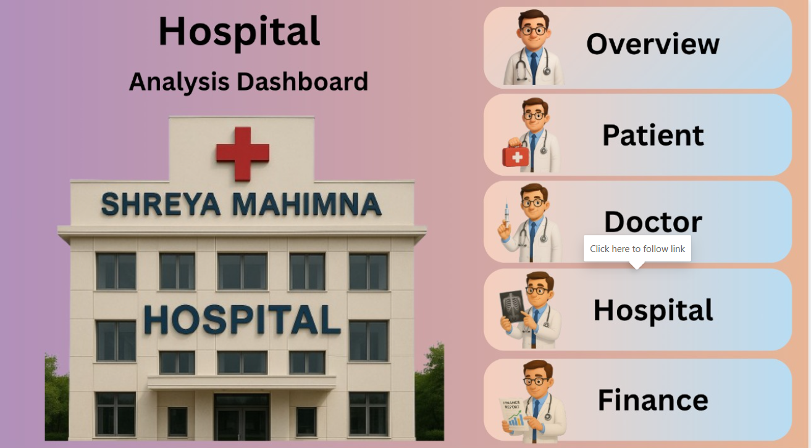

# 🏥 Hospital Analysis Dashboard

This **interactive Power BI dashboard** project presents a complete analysis of hospital operations — including patient details, doctor performance, hospital infrastructure, and financial statistics. Built with a user-friendly interface, it enables data-driven decisions for healthcare administrators and analysts.

---

## 📌 Project Highlights

- Analyze patient admissions, discharge trends, and charge types  
- Monitor doctor availability, earnings, commission, and appointments  
- Track bed occupancy, test results, and surgery schedules  
- Review financial performance including billing, staff salaries, and medicine stock  
- Interactive filters and visual insights to explore data intuitively

---

## 📁 Dashboard Pages and Previews

### 🏠 Home Page  
Entry point with clean navigation buttons to all dashboards.  


---

### 📊 Overview  
Displays overall hospital metrics like stock vs. sale, occupancy status, monthly discharges, feedback, and key counts.  


---

### 🧑‍⚕️ Patient Dashboard  
Detailed individual patient view — medical history, surgery details, billing, and feedback.  


---

### 👨‍⚕️ Doctor Dashboard  
Doctor profiles, commission calculator, total patient spend, appointments, and earnings.  


---

### 🏨 Hospital Dashboard  
Insights on age distribution, test results, bed status, and surgery schedule.  


---

### 💰 Finance Dashboard  
Breakdown of salaries, medicine sales, supplier data, and patient charge types.  


---

## 🛠️ Tech Stack

- **Microsoft Power BI Desktop**
- **DAX** for calculated fields and measures
- **Custom visuals** for interactive UI (slicers, donut charts, cards, line graphs, etc.)

---

## 🚀 How to Use

### Requirements

- Install [Power BI Desktop](https://powerbi.microsoft.com/desktop)

### Steps

1. Clone the repo:
   ```bash
   git clone https://github.com/YOUR_USERNAME/Hospital-Analysis-Dashboard.git
